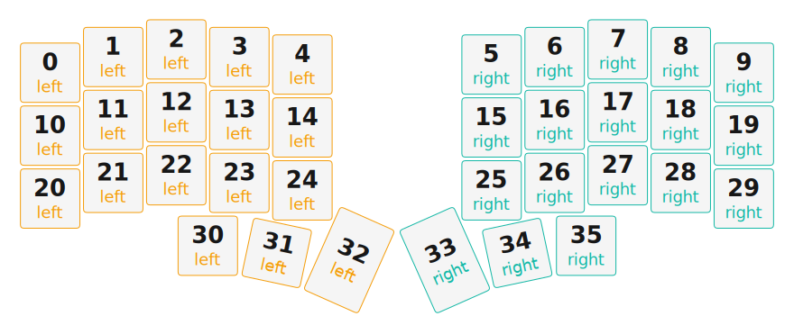

# ZMK Configuration for Split

*Generated by Shield Wizard for ZMK*



Download compiled firmware from the Actions tab. <https://zmk.dev/docs/user-setup#installing-the-firmware>

Edit your keymap <https://zmk.dev/docs/keymaps>.
User keymap is located at [`config/split.keymap`](config/split.keymap).

-----

<details>
<summary>
Shield Wizard Debug Information
</summary>

In case of broken configuration, here is the Shield Wizard internal data used to generate this configuration:

Commit: 8a52249f61161469b6d90ed8c80c4aa52b9f3858

```json
{"name":"Split","shield":"split","dongle":false,"modules":[],"layout":[{"id":"01KHPXZF65SQ57E85DEG5VYYN1","part":0,"row":0,"col":0,"w":1,"h":1,"x":0,"y":0.37,"r":0,"rx":0,"ry":0},{"id":"01KHPXZF65QZDETFBE125FBZQA","part":0,"row":0,"col":1,"w":1,"h":1,"x":1,"y":0.12,"r":0,"rx":0,"ry":0},{"id":"01KHPXZF65XJS32TEH9MXF534Y","part":0,"row":0,"col":2,"w":1,"h":1,"x":2,"y":0,"r":0,"rx":0,"ry":0},{"id":"01KHPXZF65SYVSGWMCH1RA0TPT","part":0,"row":0,"col":3,"w":1,"h":1,"x":3,"y":0.12,"r":0,"rx":0,"ry":0},{"id":"01KHPXZF657X98BS4BMPN91VWV","part":0,"row":0,"col":4,"w":1,"h":1,"x":4,"y":0.24,"r":0,"rx":0,"ry":0},{"id":"01KHPXZF65WFE5S36GX167M4D7","part":1,"row":0,"col":5,"w":1,"h":1,"x":7,"y":0.24,"r":0,"rx":0,"ry":0},{"id":"01KHPXZF65ERHV1Q9BZEPS02B9","part":1,"row":0,"col":6,"w":1,"h":1,"x":8,"y":0.12,"r":0,"rx":0,"ry":0},{"id":"01KHPXZF659YN6HFJEDKY8SSBE","part":1,"row":0,"col":7,"w":1,"h":1,"x":9,"y":0,"r":0,"rx":0,"ry":0},{"id":"01KHPXZF651GFYMVM5ET9CDGS6","part":1,"row":0,"col":8,"w":1,"h":1,"x":10,"y":0.12,"r":0,"rx":0,"ry":0},{"id":"01KHPXZF65YYB9W6E7JF6XGXS8","part":1,"row":0,"col":9,"w":1,"h":1,"x":11,"y":0.37,"r":0,"rx":0,"ry":0},{"id":"01KHPXZF65VFR7YDD217AEM5ET","part":0,"row":1,"col":0,"w":1,"h":1,"x":0,"y":1.37,"r":0,"rx":0,"ry":0},{"id":"01KHPXZF65WJ0N6NZ4QJEN7NE4","part":0,"row":1,"col":1,"w":1,"h":1,"x":1,"y":1.12,"r":0,"rx":0,"ry":0},{"id":"01KHPXZF65D8P8WMQTT7XZEDDV","part":0,"row":1,"col":2,"w":1,"h":1,"x":2,"y":1,"r":0,"rx":0,"ry":0},{"id":"01KHPXZF65WN3AXKN66PKY0D4W","part":0,"row":1,"col":3,"w":1,"h":1,"x":3,"y":1.12,"r":0,"rx":0,"ry":0},{"id":"01KHPXZF66G4ZCNGQ60PPRCDH0","part":0,"row":1,"col":4,"w":1,"h":1,"x":4,"y":1.24,"r":0,"rx":0,"ry":0},{"id":"01KHPXZF66DDHMWXSV1C6GW745","part":1,"row":1,"col":5,"w":1,"h":1,"x":7,"y":1.24,"r":0,"rx":0,"ry":0},{"id":"01KHPXZF66F3T0TK4SD1HSQGBJ","part":1,"row":1,"col":6,"w":1,"h":1,"x":8,"y":1.12,"r":0,"rx":0,"ry":0},{"id":"01KHPXZF669YKBSQZQYD6JTX73","part":1,"row":1,"col":7,"w":1,"h":1,"x":9,"y":1,"r":0,"rx":0,"ry":0},{"id":"01KHPXZF66EHBHFR3EG1DZ9R3H","part":1,"row":1,"col":8,"w":1,"h":1,"x":10,"y":1.12,"r":0,"rx":0,"ry":0},{"id":"01KHPXZF66KXH87M5VAS9XR0TQ","part":1,"row":1,"col":9,"w":1,"h":1,"x":11,"y":1.37,"r":0,"rx":0,"ry":0},{"id":"01KHPXZF66FZZVT0AKJSG27T54","part":0,"row":2,"col":0,"w":1,"h":1,"x":0,"y":2.37,"r":0,"rx":0,"ry":0},{"id":"01KHPXZF66RNJ2TX1SBXH715T5","part":0,"row":2,"col":1,"w":1,"h":1,"x":1,"y":2.12,"r":0,"rx":0,"ry":0},{"id":"01KHPXZF662C5MNXS1SZAD9B03","part":0,"row":2,"col":2,"w":1,"h":1,"x":2,"y":2,"r":0,"rx":0,"ry":0},{"id":"01KHPXZF66MBWFS6S9KAATSSF6","part":0,"row":2,"col":3,"w":1,"h":1,"x":3,"y":2.12,"r":0,"rx":0,"ry":0},{"id":"01KHPXZF660MYH9VEAH94A5AQ4","part":0,"row":2,"col":4,"w":1,"h":1,"x":4,"y":2.24,"r":0,"rx":0,"ry":0},{"id":"01KHPXZF66E2TQHRKY84M2KZDD","part":1,"row":2,"col":5,"w":1,"h":1,"x":7,"y":2.24,"r":0,"rx":0,"ry":0},{"id":"01KHPXZF662AHKVDFHM4ET2GJ8","part":1,"row":2,"col":6,"w":1,"h":1,"x":8,"y":2.12,"r":0,"rx":0,"ry":0},{"id":"01KHPXZF66FSKP80YEDZSHHMSX","part":1,"row":2,"col":7,"w":1,"h":1,"x":9,"y":2,"r":0,"rx":0,"ry":0},{"id":"01KHPXZF66X3ER68RRN0XRZDPK","part":1,"row":2,"col":8,"w":1,"h":1,"x":10,"y":2.12,"r":0,"rx":0,"ry":0},{"id":"01KHPXZF66NF0YGXHYF5XTK9BF","part":1,"row":2,"col":9,"w":1,"h":1,"x":11,"y":2.37,"r":0,"rx":0,"ry":0},{"id":"01KHPXZF67PYKTMJQAPXJEHC7Q","part":0,"row":3,"col":2,"w":1,"h":1,"x":2.5,"y":3.12,"r":0,"rx":0,"ry":0},{"id":"01KHPXZF67TN69CM53GXABFSF9","part":0,"row":3,"col":3,"w":1,"h":1,"x":3.5,"y":3.12,"r":12,"rx":3.5,"ry":4.12},{"id":"01KHPXZF674JG11ZNG34MYC9HX","part":0,"row":3,"col":4,"w":1,"h":1.5,"x":4.48,"y":2.83,"r":24,"rx":4.48,"ry":4.33},{"id":"01KHPXZF67CPH4KJVNX0R0CDDW","part":1,"row":3,"col":5,"w":1,"h":1.5,"x":6.52,"y":2.83,"r":-24,"rx":7.52,"ry":4.33},{"id":"01KHPXZF67C62J26J26B646BHJ","part":1,"row":3,"col":6,"w":1,"h":1,"x":7.5,"y":3.12,"r":-12,"rx":8.5,"ry":4.12},{"id":"01KHPXZF671G3HKACFVGDMHF62","part":1,"row":3,"col":7,"w":1,"h":1,"x":8.5,"y":3.12,"r":0,"rx":0,"ry":0}],"parts":[{"name":"left","controller":"xiao_ble","wiring":"matrix_diode","pins":{"d1":"input","d2":"input","d3":"input","d4":"input","d5":"input","d10":"output","d9":"output","d8":"output","d7":"output"},"keys":{"01KHPXZF65SQ57E85DEG5VYYN1":{"input":"d1","output":"d10"},"01KHPXZF65VFR7YDD217AEM5ET":{"input":"d1","output":"d9"},"01KHPXZF66FZZVT0AKJSG27T54":{"input":"d1","output":"d8"},"01KHPXZF65QZDETFBE125FBZQA":{"input":"d2","output":"d10"},"01KHPXZF65WJ0N6NZ4QJEN7NE4":{"input":"d2","output":"d9"},"01KHPXZF66RNJ2TX1SBXH715T5":{"input":"d2","output":"d8"},"01KHPXZF65XJS32TEH9MXF534Y":{"input":"d3","output":"d10"},"01KHPXZF65D8P8WMQTT7XZEDDV":{"input":"d3","output":"d9"},"01KHPXZF662C5MNXS1SZAD9B03":{"input":"d3","output":"d8"},"01KHPXZF65SYVSGWMCH1RA0TPT":{"input":"d4","output":"d10"},"01KHPXZF65WN3AXKN66PKY0D4W":{"input":"d4","output":"d9"},"01KHPXZF66MBWFS6S9KAATSSF6":{"input":"d4","output":"d8"},"01KHPXZF67PYKTMJQAPXJEHC7Q":{"input":"d3","output":"d7"},"01KHPXZF67TN69CM53GXABFSF9":{"input":"d4","output":"d7"},"01KHPXZF657X98BS4BMPN91VWV":{"input":"d5","output":"d10"},"01KHPXZF66G4ZCNGQ60PPRCDH0":{"input":"d5","output":"d9"},"01KHPXZF660MYH9VEAH94A5AQ4":{"input":"d5","output":"d8"},"01KHPXZF674JG11ZNG34MYC9HX":{"input":"d5","output":"d7"}},"encoders":[],"buses":[{"name":"spi0","devices":[],"type":"spi"},{"name":"spi1","devices":[],"type":"spi"},{"name":"spi2","devices":[],"type":"spi"},{"name":"spi3","devices":[],"type":"spi"},{"name":"i2c0","devices":[],"type":"i2c"},{"name":"i2c1","devices":[],"type":"i2c"}]},{"name":"right","controller":"xiao_ble","wiring":"matrix_diode","pins":{"d1":"input","d2":"input","d3":"input","d4":"input","d5":"input","d10":"output","d9":"output","d8":"output","d7":"output"},"keys":{"01KHPXZF65WFE5S36GX167M4D7":{"input":"d5","output":"d10"},"01KHPXZF65ERHV1Q9BZEPS02B9":{"input":"d4","output":"d10"},"01KHPXZF659YN6HFJEDKY8SSBE":{"input":"d3","output":"d10"},"01KHPXZF651GFYMVM5ET9CDGS6":{"input":"d2","output":"d10"},"01KHPXZF65YYB9W6E7JF6XGXS8":{"input":"d1","output":"d10"},"01KHPXZF66DDHMWXSV1C6GW745":{"input":"d5","output":"d9"},"01KHPXZF66F3T0TK4SD1HSQGBJ":{"input":"d4","output":"d9"},"01KHPXZF669YKBSQZQYD6JTX73":{"input":"d3","output":"d9"},"01KHPXZF66EHBHFR3EG1DZ9R3H":{"input":"d2","output":"d9"},"01KHPXZF66KXH87M5VAS9XR0TQ":{"input":"d1","output":"d9"},"01KHPXZF66E2TQHRKY84M2KZDD":{"input":"d5","output":"d8"},"01KHPXZF662AHKVDFHM4ET2GJ8":{"input":"d4","output":"d8"},"01KHPXZF66FSKP80YEDZSHHMSX":{"input":"d3","output":"d8"},"01KHPXZF66X3ER68RRN0XRZDPK":{"input":"d2","output":"d8"},"01KHPXZF66NF0YGXHYF5XTK9BF":{"input":"d1","output":"d8"},"01KHPXZF67CPH4KJVNX0R0CDDW":{"input":"d5","output":"d7"},"01KHPXZF67C62J26J26B646BHJ":{"input":"d4","output":"d7"},"01KHPXZF671G3HKACFVGDMHF62":{"input":"d3","output":"d7"}},"encoders":[],"buses":[{"name":"spi0","devices":[],"type":"spi"},{"name":"spi1","devices":[],"type":"spi"},{"name":"spi2","devices":[],"type":"spi"},{"name":"spi3","devices":[],"type":"spi"},{"name":"i2c0","devices":[],"type":"i2c"},{"name":"i2c1","devices":[],"type":"i2c"}]}]}
```

</details>
